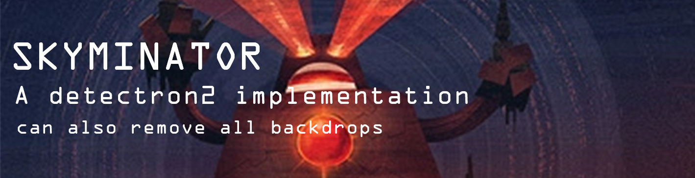
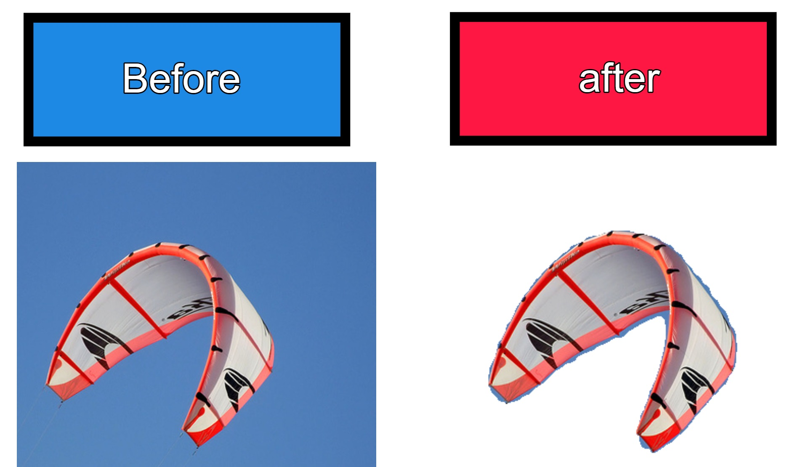

Chaos + Prints designed by Craig Henry

# Sky removal tool
This program uses Detectron2 pre-trained model and removes skys in the COCO dataset


### Dependencies 
I used Python 3.8

Pytorch, Cuda and Numpy
```sh
$ conda install pytorch torchvision torchaudio cudatoolkit=11.0 -c pytorch
$ pip install numpy
```
Installing detectron2:
```sh
$ git clone https://github.com/facebookresearch/detectron2
$ cd detectron2
$ pip install -e .
```


### Installation

```sh
$ git clone https://github.com/Xcompanygames/Skyminator
```

### How to use
* Put the Skyminator.ipynb file in a folder with a zip containing images 
* Under "Loading our data" change resp to the name of your zip 
* Run ALL the notebook
* A folder named sky_treminated_images will be created, in it all the images that detectron2 found skys in them and deleted them


### Credit
Made by Oriel Pinhas, Detectron2 by Facebook

